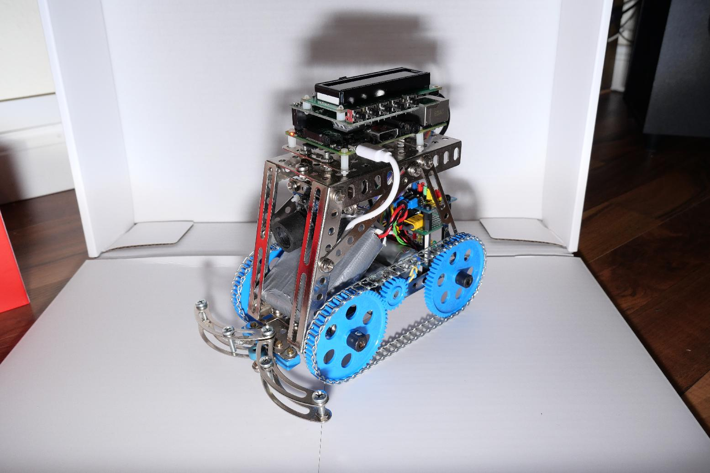

# Java-Webserver

## Description
This project runs on a Raspberry Pi, that controls motors to drive a camera in a room.
The video is send to a connected browser. The control is also done inside the web app.

## Development Team
Daniel Skrzipek, Markus Krenn

## Prerequisits
1. Make sure `JAVA_HOME` is set:

    echo $JAVA_HOME

2. Make sure `"vmArgs": "-Djava.library.path=jni"` is set!

## Run
Run main at `Webserver.java` and open `<server-ip>:1111` with any browser.

In the browser you can use `W A S D Space` buttons for navigation.
